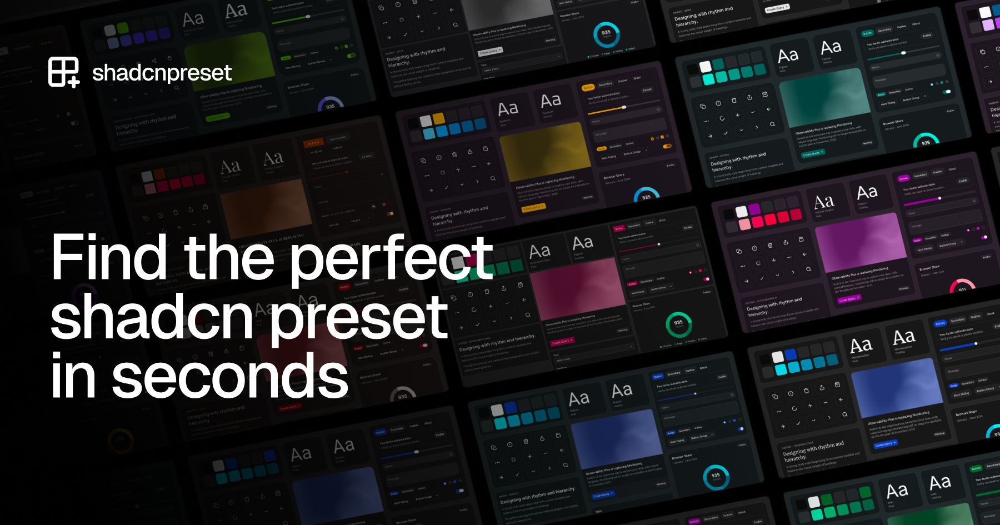

<p align="center">
  
</p>

<h1 align="center">shadcnpreset</h1>

<p align="center">
  Free & open-source platform for discovering, generating, previewing, and working with shadcn/ui presets & themes.<br/>
  Describe what you're building. AI surfaces matching presets, shows real components, and helps you choose fast.
</p>

<p align="center">
  <a href="https://github.com/morganfeeney/shadcnpreset"></a>
  <a href="https://x.com/morganfeeney"></a>
  <a href="https://vercel.com/open-source-program"></a>
</p>

<p align="center">
  <a href="https://shadcnpreset.com">Get Started</a> ·
  <a href="https://shadcnpreset.com/tools">Tools</a> ·
  <a href="https://shadcnpreset.com/community">Community</a>
</p>

## Features

- ✨ **AI-powered discovery** — Describe the look-and-feel or product type to get matching presets
- 🖥️ **Preview presets on real UI** — Dashboards, auth screens, and more
- ♿ **Accessibility-first** — Browse WCAG-compliant presets and check contrast
- 🛠️ **Developer tools** — CSS generator, contrast checker, Figma variables, and more
- ❤️ **Community-driven** — Vote, save favourites, and share preset URLs
- 📦 **Built on shadcn/ui** — Presets and create/customizer stay aligned with upstream

## Repository structure

| Path | Description |
|------|-------------|
| `apps/shadcnpreset` | Next.js platform (discovery, tools, auth, voting) |
| `apps/figma-preset-plugin` | Figma variables plugin |

The embedded **create** customizer is hosted by a separate shadcn/ui fork and loaded via `NEXT_PUBLIC_V4_URL`.

## Development

In order to utilise the shadcn/ui create customizer this repo is dependent upon a custom fork of shadcn/ui, it will run without it, but is required preset previews and create functionality.

```bash
pnpm install

# Product site (http://localhost:4010)
pnpm dev
```

shadcn/ui fork, for iframe previews:

```bash
cd ../shadcn-ui-fork
pnpm v4:dev          # http://localhost:4000
```

shadcnpreset is also dependent upon shadcn/ui styles/themes, the following script can be run to sync them in this repo from the fork:

```bash
pnpm sync:v4-vendor
```

See [`apps/shadcnpreset/.env.example`](./apps/shadcnpreset/.env.example) for environment variables (including `SHADCNPRESET_FORK_PATH` for the sync script).

## Contributing

Contributions are welcome! Please see the [Contributing Guide](./CONTRIBUTING.md).

## License

Licensed under the [MIT License](./LICENSE.md).

Copyright (c) 2026 Morgan Feeney
