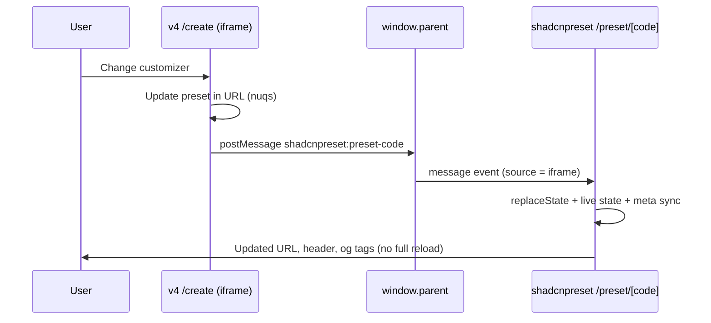

# shadcnpreset ↔ v4 fork integration

This document describes how the **preset detail page** (`/preset/[code]`) stays in sync with the **embedded v4 create UI** when someone edits the customizer—without full page reloads, and with shareable URLs and social metadata kept up to date.

## Problem

The preset page loads v4’s `/create` experience in an **iframe** (`?preset=…&embed=1`). When the user changes options, v4 updates its own URL and preset code inside the iframe. The host page’s address bar and metadata would otherwise stay stuck on the **initial** preset from the first load.

## High-level flow

1. **v4 (inside the iframe)** encodes design changes into a single **preset code** and updates the iframe URL (nuqs).  
2. **`ShadcnpresetCreatePageIntegration`** (mounted on v4’s `/create` route) detects `embed=1` and `window.parent !== window`, then `postMessage`s the parent with type `shadcnpreset:preset-code` and `{ preset: "<code>" }`.  
3. **shadcnpreset (top window)** `PresetV4Frame` listens for that message. It only trusts messages whose `event.source` is **that iframe’s** `contentWindow` (not random tabs or extensions).  
4. On the preset page, **`PresetPageLiveProvider`** supplies **`onPresetFromIframe`**. The handler updates **React state** for the live code and applies **`history.replaceState`** so the visible URL changes **without** an App Router navigation (which would re-fetch RSC and reload the iframe).  
5. **`syncPresetPageSocialMeta`** runs on the client and rewrites `<title>`, canonical, Open Graph, and Twitter meta tags (including **`og:image`** with a cache-busting query) so previews and debuggers see the current preset.  
6. **Preset code title / vote / share** read the live context so the UI matches the URL.



## Why `history.replaceState` instead of `router.replace`?

`router.replace()` triggers a **full App Router navigation**: server components run again, props to the iframe change, and the iframe **`src`** is recomputed—so the iframe **reloads** and the experience feels like a full refresh.

`history.replaceState` only changes the browser’s URL bar. The React tree for the preset page was already mounted; we update **client state** (`PresetPageLiveProvider`) so the header and meta stay consistent. The iframe keeps running; v4 already applied the new preset **inside** the frame via client-side routing.

## Message contract

| Item | Value |
|------|--------|
| `postMessage` **type** | `shadcnpreset:preset-code` |
| **Payload** | `{ type, preset: string }` (`preset` must pass `isPresetCode`) |
| **Defined in** | v4: `shadcnpreset-fork/constants.ts` as `PRESET_CODE_SYNC_MESSAGE_TYPE` |
| **Must match** | shadcnpreset: `lib/shadcnpreset-postmessage.ts` → `SHADCNPRESET_PRESET_CODE_MESSAGE_TYPE` |

The verify script asserts both sides still contain the same literal token.

## Where the code lives

| Location | Role |
|----------|------|
| `apps/v4/.../shadcnpreset-fork/` | Sends `postMessage` from `/create` when embedded |
| `apps/shadcnpreset/hooks/use-preset-parent-url-sync.ts` | Listens on `window`; calls `onPresetFromIframe` or falls back to `router.replace` |
| `apps/shadcnpreset/components/preset-v4-frame.tsx` | Passes iframe ref + live callback into the hook; theme sync to iframe unchanged |
| `apps/shadcnpreset/components/preset-page-live-context.tsx` | Live preset state + `replaceState` |
| `apps/shadcnpreset/lib/sync-preset-social-meta.ts` | Updates document meta / OG / Twitter after URL changes |
| `apps/shadcnpreset/app/preset/[code]/opengraph-image.tsx` | Dynamic OG image; URL referenced from synced `og:image` |

## Open Graph and meta tags

Server `generateMetadata` and `opengraph-image.tsx` describe the **initial** load. After client-side URL changes, **`syncPresetPageSocialMeta`** removes duplicate `og:*` tags (Next can emit several), sets a single **`og:image`** URL pointing at `/preset/[code]/opengraph-image?...` (cache buster), and aligns Twitter and canonical tags.

## Local development

- Run **v4** on the port expected by `NEXT_PUBLIC_V4_URL` (often `http://localhost:4000`).  
- Run **shadcnpreset** with the **same** `NEXT_PUBLIC_V4_URL` so the iframe loads your local v4 app.  
- Cross-origin `postMessage` is fine; origin is validated via `event.source === iframe.contentWindow`.

## Tests

Vitest coverage for this integration lives under `apps/shadcnpreset/lib/*.test.ts`:

| File | What it checks |
|------|------------------|
| `fork-message-constants.test.ts` | v4 `PRESET_CODE_SYNC_MESSAGE_TYPE` and shadcnpreset `SHADCNPRESET_PRESET_CODE_MESSAGE_TYPE` stay identical |
| `preset-route.test.ts` | `/preset/[code]` path parsing |
| `preset-meta.test.ts` | Shared meta description string |
| `build-preset-social-meta.test.ts` | Page URL, branded title, and cache-busted `og:image` URL (no DOM) |

Run:

```bash
pnpm --filter shadcnpreset test
```

## Merging upstream

See [UPSTREAM.md](../UPSTREAM.md) for the post-merge checklist and `pnpm verify:shadcnpreset-fork`.
